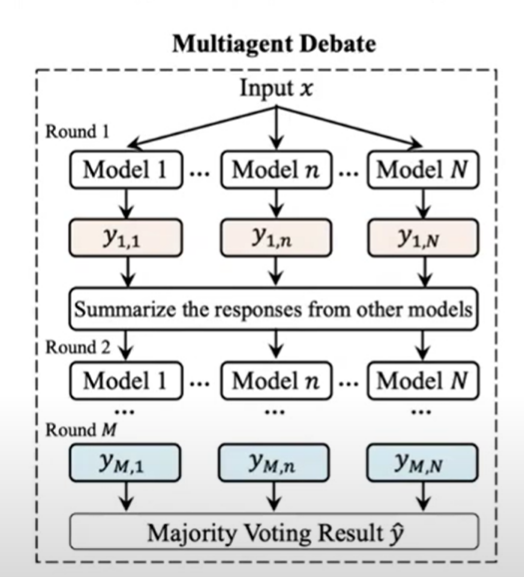

# Multi-agent-Debate
While implementing remember as we will add more agents the context window will be increased and model performance will be suffered for that we will summarize the responses from previous debate and then we will pass that to the agents in the next debate.

Additional point: We can do chain of thought before doing reasoning for better debate.

Here is the diagram for multiagent debate
